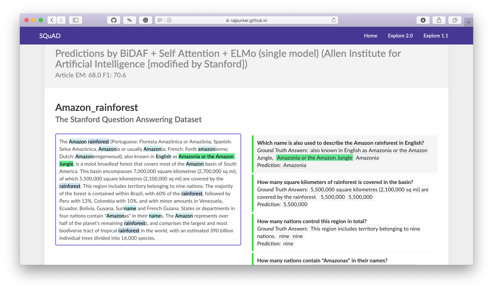
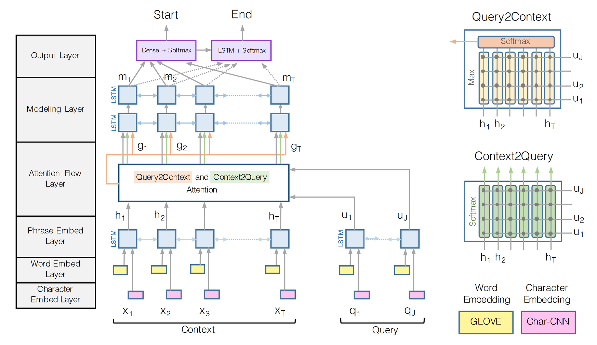

# Question Answering with SQuAD using BiDAF model

# SQuAD 

Question-answer pairs for a sample passage in the SQuAD dataset. Each of the answers is a segment of text from the passage.
- Sample from [SQuAD 2.0](https://rajpurkar.github.io/SQuAD-explorer/)

# Model Architecture

Source: [BiDAF paper](https://arxiv.org/abs/1611.01603)

Data Source -> SQuAD 2.0: https://rajpurkar.github.io/SQuAD-explorer/ 
# Useful Links

* SQuAD 2.0: https://rajpurkar.github.io/SQuAD-explorer/
* Bi-Directional Attention Flow for Machine Comprehension
    - Authors' TensorFlow implementation: https://allenai.github.io/bi-att-flow/
* BiDAF baseline model: https://github.com/chrischute/squad
* PyTorch pretrained BERT: https://github.com/huggingface/pytorch-pretrained-BERT
* GloVE: https://nlp.stanford.edu/projects/glove/
* **Papers With Code** 
    - SQuAD: 100,000+ Questions for Machine Comprehension of Text: https://paperswithcode.com/paper/squad-100000-questions-for-machine
    - Bidirectional Attention Flow for Machine Comprehension : https://paperswithcode.com/paper/bidirectional-attention-flow-for-machine
* Understanding LSTM Networks: http://colah.github.io/posts/2015-08-Understanding-LSTMs/
* A Brief Overview of Attention Mechanism: https://medium.com/syncedreview/a-brief-overview-of-attention-mechanism-13c578ba9129
* Understanding Encoder-Decoder Sequence to Sequence Model: https://towardsdatascience.com/understanding-encoder-decoder-sequence-to-sequence-model-679e04af4346
* Semantic Word Embeddings: https://www.offconvex.org/2015/12/12/word-embeddings-1/
* NLP — Building a Question Answering model: https://towardsdatascience.com/nlp-building-a-question-answering-model-ed0529a68c54
* BERT - http://docs.deeppavlov.ai/en/master/features/models/squad.html

	